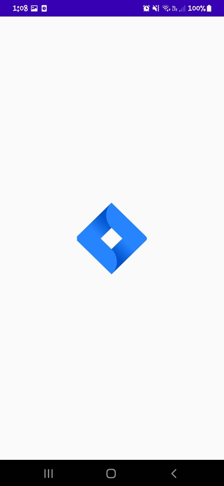

# Prueba Técnica Lvl Consulting

Esta se dividio en dos partes principales: un backend desarrollado con Spring Boot y una aplicación móvil para Android desarrollada con Kotlin y Jetpack Compose.

## Contenidos

- [Backend](#backend)
- [Android](#android)

## Backend

### Versiones usadas
- Java 17
- PostgreSQL 15

### Configuración
1. Base de Datos
Esta base de datos siguien el diagrama entidad-relación que se encuentra en la carpeta `/backend`.
    - Crear una base de datos en PostgreSQL con el nombre `jira`.
    - Utilizar el backup `db-jira-backup.sql` que se encuentra en `/backend` para restaurar la base de datos.

2. Configuaración de Spring Boot
    - En el archivo `application.properties` que se encuentra en `/backend/api-jira/src/main/resources` se deben configurar las credenciales de la base de datos.
    ```properties
    spring.application.name=api-jira
    spring.datasource.url: jdbc:postgresql://localhost:5432/jira
    spring.datasource.username: postgres
    spring.datasource.password: postgres
    spring.jpa.show-sql= true
    spring.jpa.generate-ddl= true
    spring.jpa.hibernate.ddl-auto=update
    ```
    - Puede cambiar el puerto en el que se ejecutará la aplicación en el archivo `application.properties`.
    ```properties
    server.port=8080
    ```
### Endpoints
- `/api/v1/auth/login` - POST - Iniciar sesión
- `/api/v1/auth/reset-credentials` - POST - Restablecer credenciales (Por defecto al correo)
- `/api/v1/users` - PUT - Actualizar datos de usuario
- `/api/v1/users/{id}/projects` - GET - Obtener proyectos de un usuario
- `/api/v1/projects` - POST - Crear un proyecto
- `/api/v1/projects?userId={userId}&code={code}&name={name}&state={state}&date_start={date_start}&date_end={date_end}` - GET - Buscar proyectos en busqueda avanzada


## Android
### Versiones usadas
- Kotlin 1.7.0
- Jetpack Compose 1.6.8
- Api 34

### Dependencias
- Retrofit2
- Hilt
- Dagger
- Room
- Navigation

### Configuración
1. Configuración de la URL del Backend
    - En el archivo `ApiSourceModule.kt` que se encuentra en `/android/app/src/main/java/com/example/prueba_tecnica_mobile/di` se debe configurar la URL del backend.

    ```kotlin
    @Named("BaseUrl")
    fun provideBaseUrl() = "http://192.168.1.42:8080/api/v1/"
    ```
    - Cambiar la dirección IP por la dirección IP de la máquina en la que se está ejecutando el backend.

### Screens
- Splash Screen



- Login Screen


- Home Screen


- Profile Screen


- Create Project Screen


- Camera Screen

